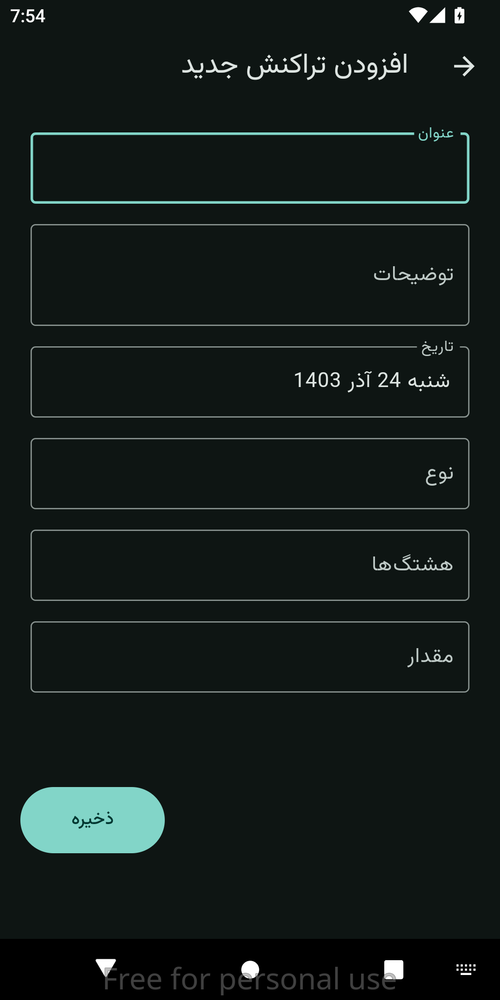

# Personal Financial Accounting App

This is a **simple and user-friendly personal financial accounting app** built with Flutter and Material 3. The app aims to provide essential accounting features for tracking your income and expenses. It uses **ObjectBox** as the database for fast and efficient local storage.

## Features
- **Add Transactions**: Easily log your transactions with the following details:
    - Title
    - Description
    - Amount
    - Type (Income or Expense)
    - Date (Jalali Date Picker)
    - Hashtags
- **CRUD Operations on Hashtags**: Manage your hashtags for better categorization of transactions.
- **Home Screen**: Displays transaction logs for the current month, including:
    - Total earned money
    - Total spent money

## Technologies Used
- **Flutter**: For cross-platform app development.
- **Material 3**: To ensure modern and consistent UI design.
- **ObjectBox**: For fast, efficient, and easy-to-use local database management.

## Current Roadmap
### In Progress
- Read Bank Messages 
- Enhance the home screen UI:
    - Show total spent and earned money using charts (by month, date, and year).
- Enable search functionality:
    - Search through transactions.
    - Filter results based on hashtags.
- Add the ability to **edit existing transactions**.

### Future Plans
- **Cloud Sync**: Backup and synchronize data across devices.
- **Real-Time Currency Prices**: Display updated currency exchange rates.

## Installation
1. Clone this repository.
```bash
git clone https://github.com/mdpe-ir/md_financial
```
2. Navigate to the project directory.
```bash
cd md_financial
```
3. Install dependencies.
```bash
flutter pub get
```
4. Run the app.
```bash
flutter run
```

## Contribution
Contributions are welcome! Feel free to submit issues or pull requests to help improve the app.

## License
This project is licensed under the MIT License. See the [LICENSE](LICENSE) file for details.

## Screenshots




---

### Feedback
We value your feedback! If you have any suggestions or issues, please feel free to reach out.
